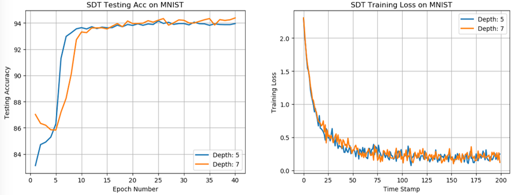

## Introduction 
This is the pytorch implementation on Soft Decision Tree (SDT), appearing in the paper "Distilling a Neural Network Into a Soft Decision Tree". 2017 (https://arxiv.org/abs/1711.09784).

## Quick Start 
Here I offer a demo on MNIST. To run the demo, simply type the following command:
``` 
python main.py 
``` 

## Parameters

| Parameter | Type | Description |
|-----------|------|-------------|
| input_dim | int  | The number of input dimensions |
| output_dim | int| The number of output dimensions (e.g., the number of classes for multi-class classification) |
| depth | int| Tree depth, default is `5` |
| lamda | float | The coefficient of the regularization term, default is `1e-3` |
| use_cuda | bool | Whether use GPU to train / evaluate the model, default is `False` |

**BTW:** Please see `main.py` for details on how to use SDT. If you are interested in the implementation on SDT, please see `SDT.py` for details. Instead of explicitly defining the class of internal node and leaf node, I directly use a linear layer with sigmoid activation to simulate all internals nodes to leverage the power of PyTorch.

### Frequently Asked Questions
1. **Training loss suddenly turns into NAN**
    * **Reason:** Sigmoid function used in internal nodes of SDT can be unstable during the training stage, as its gradient is much close to `0` when the absolute value of input is large.
    * **Solution:** Using a smaller learning rate typically works.
2. **Exact training time**
    * **Setup:** MNIST Dataset | Tree Depth: 5 | Epoch: 40 | Batch Size: 128
    * **Results:** Around 15 minutes on a single RTX-2080ti

## MNIST Experiment Result
After training for 40 epochs with `batch_size` 128, the best testing accuracy using a SDT model of depth **5**, **7** are **94.15** and **94.38**, respectively (which is much close to the accuracy reported in raw paper). Related hyper-parameters are available in `main.py`. Better and more stable performance can be achieved by fine-tuning hyper-parameters. 

Below are the testing accuracy curve and training loss curve. The testing accuracy of SDT is evaluated after each training epoch. 



## Package Dependencies
SDT is originally developed in `Python 3.6.5`. Following are the name and version of packages used in SDT. In my practice, it works fine under different versions of Python or PyTorch.

 - pytorch 0.4.1
 - torchvision 0.2.1
